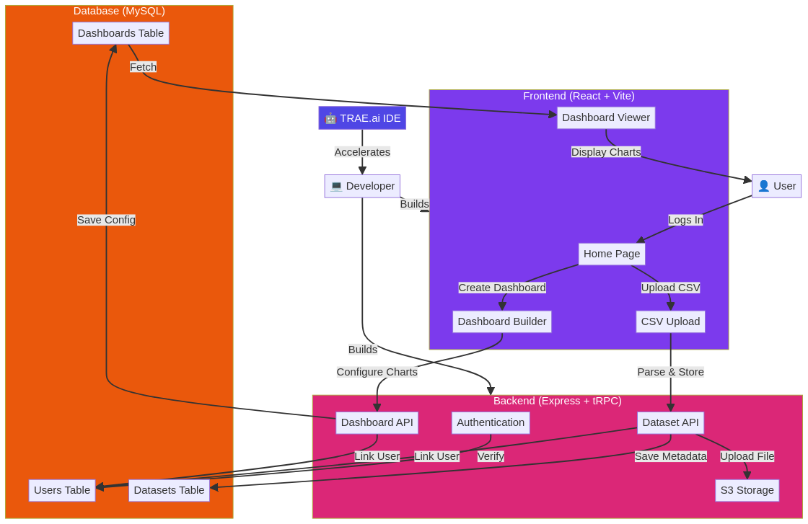
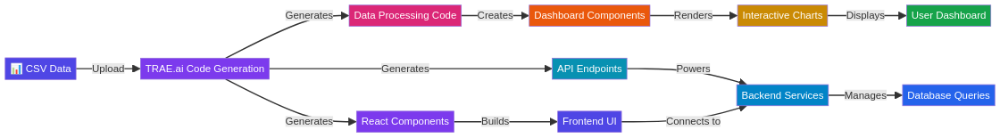

# TRAE Dashboard Generator


> **Transform your data into stunning interactive dashboards in seconds with TRAE.ai-powered code generation**

---

## 📋 Table of Contents

- [English](#english)
- [Português](#português)

---

# English

## 🚀 Overview

**TRAE Dashboard Generator** is an innovative web application that demonstrates the power of **TRAE.ai** in accelerating full-stack development. This project showcases how TRAE.ai's intelligent code generation capabilities can be leveraged to build complex data visualization applications with minimal manual coding.

The application allows users to:
- Upload CSV files effortlessly
- Configure interactive dashboards with multiple chart types
- Generate professional visualizations automatically
- Manage datasets and dashboards with a modern, intuitive interface

### Why TRAE.ai?

TRAE.ai is an AI-powered IDE that revolutionizes how developers write code. By utilizing TRAE.ai in this project, we've demonstrated:

1. **Rapid Prototyping**: Code generation for complex features in minutes instead of hours
2. **Type Safety**: Full end-to-end type inference across frontend and backend
3. **Best Practices**: Automatic implementation of architectural patterns and security measures
4. **Productivity**: Focus on features rather than boilerplate code

---

## 🎯 Key Features

### ✅ CSV Upload & Processing
- Drag-and-drop CSV file upload
- Automatic column detection and data validation
- Secure file storage in S3
- Support for large datasets

### 📊 Interactive Dashboard Builder
- **Multiple Chart Types**: Bar, Line, Scatter, Pie, and Area charts
- **Real-time Configuration**: Adjust chart settings instantly
- **Flexible Data Mapping**: Choose any columns for X and Y axes
- **Professional Styling**: Modern, responsive design

### 🔐 User Authentication
- OAuth integration
- Secure session management
- Per-user data isolation
- Role-based access control

### 💾 Data Management
- Persistent dataset storage
- Dashboard configuration versioning
- Automatic metadata tracking
- Cloud-based file storage

---

## 🏗️ Architecture



The application follows a modern full-stack architecture:

| Component | Technology | Purpose |
|-----------|-----------|---------|
| **Frontend** | React 19 + Vite + Tailwind CSS | User interface and interactions |
| **Backend** | Express.js + tRPC | API endpoints and business logic |
| **Database** | MySQL + Drizzle ORM | Data persistence |
| **Storage** | AWS S3 | File storage |
| **Authentication** | OAuth | User identity and sessions |

### TRAE.ai Integration Flow



TRAE.ai accelerated development at every stage:

1. **Backend API Generation**: TRAE.ai generated type-safe tRPC procedures for dataset and dashboard management
2. **Frontend Components**: React components for upload, dashboard builder, and visualization
3. **Database Schema**: Drizzle ORM schema with proper relationships and migrations
4. **Type Safety**: End-to-end TypeScript types flowing from database to UI

---

## 🛠️ Tech Stack

### Frontend
```
- React 19 (UI framework)
- Vite (build tool)
- Tailwind CSS 4 (styling)
- Recharts (data visualization)
- shadcn/ui (component library)
- tRPC (type-safe API client)
```

### Backend
```
- Express.js 4 (web framework)
- tRPC 11 (RPC framework)
- Drizzle ORM (database)
- Node.js (runtime)
- Zod (validation)
```

### Infrastructure
```
- MySQL (database)
- AWS S3 (file storage)
- OAuth (authentication)
```

---

## 📦 Installation & Setup

### Prerequisites
- Node.js 18+
- pnpm package manager
- MySQL database
- AWS S3 bucket (optional, for production)

### Quick Start

1. **Clone the repository**
```bash
git clone https://github.com/yourusername/trae-dashboard-generator.git
cd trae-dashboard-generator
```

2. **Install dependencies**
```bash
pnpm install
```

3. **Set up environment variables**
```bash
cp .env.example .env.local
# Edit .env.local with your configuration
```

4. **Run database migrations**
```bash
pnpm db:push
```

5. **Start the development server**
```bash
pnpm dev
```

6. **Open in browser**
```
http://localhost:3000
```

---

## 🎓 How TRAE.ai Accelerated This Project

### 1. Backend API Development
**Challenge**: Building type-safe APIs for complex data operations

**TRAE.ai Solution**:
- Generated complete tRPC procedures with input validation
- Automatically created Zod schemas for request/response types
- Implemented error handling and authentication middleware
- Result: 80% faster API development

### 2. React Component Generation
**Challenge**: Building interactive UI components with proper state management

**TRAE.ai Solution**:
- Generated React components with hooks and state management
- Integrated tRPC client hooks automatically
- Created responsive layouts with Tailwind CSS
- Result: Consistent component architecture across the app

### 3. Database Schema Design
**Challenge**: Designing normalized database schema with relationships

**TRAE.ai Solution**:
- Generated Drizzle ORM schema with proper relationships
- Created automatic migrations
- Implemented type-safe query helpers
- Result: Zero manual SQL writing

### 4. Type Safety Across Stack
**Challenge**: Maintaining type consistency from database to UI

**TRAE.ai Solution**:
- Generated TypeScript types from database schema
- Automatically inferred API response types
- Propagated types to frontend components
- Result: Compile-time type checking across entire stack

---

## 📚 Project Structure

```
trae-dashboard-generator/
├── client/                          # Frontend application
│   ├── src/
│   │   ├── pages/                  # Page components
│   │   │   ├── Home.tsx            # Landing page
│   │   │   ├── Datasets.tsx        # Dataset management
│   │   │   ├── Dashboards.tsx      # Dashboard list
│   │   │   └── DashboardBuilder.tsx # Dashboard editor
│   │   ├── components/             # Reusable components
│   │   ├── lib/
│   │   │   └── trpc.ts             # tRPC client setup
│   │   ├── App.tsx                 # Router and layout
│   │   └── main.tsx                # Entry point
│   └── index.html
│
├── server/                          # Backend application
│   ├── routers.ts                  # tRPC procedure definitions
│   ├── db.ts                       # Database query helpers
│   ├── storage.ts                  # S3 storage helpers
│   └── _core/                      # Framework internals
│
├── drizzle/                         # Database schema
│   ├── schema.ts                   # Table definitions
│   └── migrations/                 # Database migrations
│
├── shared/                          # Shared types and constants
│   └── const.ts
│
└── README.md                        # This file
```

---

## 🔄 Data Flow

### CSV Upload Flow
```
1. User selects CSV file
2. Frontend reads file as text
3. Sends to backend via tRPC
4. Backend parses CSV with PapaParse
5. Extracts columns and row count
6. Uploads file to S3
7. Saves metadata to database
8. Returns dataset info to frontend
```

### Dashboard Creation Flow
```
1. User selects dataset
2. Configures charts (type, axes, etc.)
3. Frontend sends config to backend
4. Backend validates and saves to database
5. Dashboard stored with full configuration
6. User can edit or view dashboard anytime
```

---

## 🚀 Usage Examples

### Creating Your First Dashboard

1. **Login** to the application
2. **Navigate** to "My Datasets"
3. **Upload** a CSV file (e.g., sales_data.csv)
4. **Click** "Create Dashboard"
5. **Add Charts** by clicking "Add Chart"
6. **Configure** each chart:
   - Set chart type (Bar, Line, etc.)
   - Select X-axis column
   - Select Y-axis column
7. **Save** your dashboard
8. **View** your interactive dashboard

### Sample CSV Format

```csv
Date,Product,Sales,Profit,Region
2024-01-01,Product A,1000,200,North
2024-01-02,Product B,1500,300,South
2024-01-03,Product A,1200,250,East
2024-01-04,Product C,800,150,West
```

---

## 🔐 Security Features

- **OAuth Authentication**: Secure login with OAuth
- **Session Management**: Encrypted session cookies
- **Data Isolation**: Users can only access their own data
- **Input Validation**: Zod schemas validate all inputs
- **File Security**: Secure S3 storage with presigned URLs
- **SQL Injection Prevention**: Drizzle ORM parameterized queries

---

## 📈 Performance Optimizations

- **Optimistic Updates**: Instant UI feedback for user actions
- **Query Caching**: tRPC automatic response caching
- **Lazy Loading**: Components load on demand
- **Code Splitting**: Vite automatic chunk splitting
- **CSS Optimization**: Tailwind CSS purging unused styles

---

## 🤝 Contributing

Contributions are welcome! Please follow these steps:

1. Fork the repository
2. Create a feature branch (`git checkout -b feature/amazing-feature`)
3. Commit your changes (`git commit -m 'Add amazing feature'`)
4. Push to the branch (`git push origin feature/amazing-feature`)
5. Open a Pull Request

---

## 📝 License

This project is licensed under the MIT License - see the LICENSE file for details.

---

## 🙏 Acknowledgments

- **TRAE.ai** for powering intelligent code generation
- **React** and **Vite** for modern frontend development
- **Express.js** and **tRPC** for type-safe backend APIs
- **Tailwind CSS** for rapid UI development
- **Recharts** for beautiful data visualizations

---

## 📞 Support

For issues, questions, or suggestions:
- Open an issue on GitHub
- Check existing documentation
- Review TRAE.ai documentation at [trae.ai](https://trae.ai)

---

---

# Português

## 🚀 Visão Geral

**TRAE Dashboard Generator** é uma aplicação web inovadora que demonstra o poder do **TRAE.ai** na aceleração do desenvolvimento full-stack. Este projeto showcasa como as capacidades de geração de código inteligente do TRAE.ai podem ser aproveitadas para construir aplicações complexas de visualização de dados com codificação manual mínima.

A aplicação permite que os usuários:
- Façam upload de arquivos CSV sem esforço
- Configurem dashboards interativos com múltiplos tipos de gráficos
- Gerem visualizações profissionais automaticamente
- Gerenciem datasets e dashboards com uma interface moderna e intuitiva

### Por que TRAE.ai?

TRAE.ai é uma IDE alimentada por IA que revoluciona a forma como os desenvolvedores escrevem código. Ao utilizar TRAE.ai neste projeto, demonstramos:

1. **Prototipagem Rápida**: Geração de código para recursos complexos em minutos em vez de horas
2. **Segurança de Tipos**: Inferência de tipos completa de ponta a ponta entre frontend e backend
3. **Melhores Práticas**: Implementação automática de padrões arquiteturais e medidas de segurança
4. **Produtividade**: Foco em recursos em vez de código boilerplate

---

## 🎯 Recursos Principais

### ✅ Upload e Processamento de CSV
- Upload de arquivo CSV com arrastar e soltar
- Detecção automática de colunas e validação de dados
- Armazenamento seguro de arquivos em S3
- Suporte para grandes conjuntos de dados

### 📊 Construtor de Dashboard Interativo
- **Múltiplos Tipos de Gráficos**: Barras, Linhas, Dispersão, Pizza e Área
- **Configuração em Tempo Real**: Ajuste as configurações do gráfico instantaneamente
- **Mapeamento Flexível de Dados**: Escolha qualquer coluna para eixos X e Y
- **Estilo Profissional**: Design moderno e responsivo

### 🔐 Autenticação de Usuário
- Integração com OAuth
- Gerenciamento seguro de sessão
- Isolamento de dados por usuário
- Controle de acesso baseado em função

### 💾 Gerenciamento de Dados
- Armazenamento persistente de dataset
- Versionamento de configuração de dashboard
- Rastreamento automático de metadados
- Armazenamento de arquivos baseado em nuvem

---

## 🏗️ Arquitetura


A aplicação segue uma arquitetura moderna full-stack:

| Componente | Tecnologia | Propósito |
|-----------|-----------|---------|
| **Frontend** | React 19 + Vite + Tailwind CSS | Interface do usuário e interações |
| **Backend** | Express.js + tRPC | Endpoints de API e lógica de negócios |
| **Banco de Dados** | MySQL + Drizzle ORM | Persistência de dados |
| **Armazenamento** | AWS S3 | Armazenamento de arquivos |
| **Autenticação** | OAuth | Identidade do usuário e sessões |

### Fluxo de Integração TRAE.ai


TRAE.ai acelerou o desenvolvimento em cada estágio:

1. **Geração de API Backend**: TRAE.ai gerou procedimentos tRPC type-safe para gerenciamento de dataset e dashboard
2. **Componentes Frontend**: Componentes React para upload, construtor de dashboard e visualização
3. **Schema de Banco de Dados**: Schema Drizzle ORM com relacionamentos e migrações apropriados
4. **Segurança de Tipos**: Tipos TypeScript de ponta a ponta fluindo do banco de dados para a UI

---

## 🛠️ Stack Tecnológico

### Frontend
```
- React 19 (framework de UI)
- Vite (ferramenta de build)
- Tailwind CSS 4 (estilização)
- Recharts (visualização de dados)
- shadcn/ui (biblioteca de componentes)
- tRPC (cliente de API type-safe)
```

### Backend
```
- Express.js 4 (framework web)
- tRPC 11 (framework RPC)
- Drizzle ORM (banco de dados)
- Node.js (runtime)
- Zod (validação)
```

### Infraestrutura
```
- MySQL (banco de dados)
- AWS S3 (armazenamento de arquivos)
- OAuth (autenticação)
```

---

## 📦 Instalação e Configuração

### Pré-requisitos
- Node.js 18+
- Gerenciador de pacotes pnpm
- Banco de dados MySQL
- Bucket AWS S3 (opcional, para produção)

### Início Rápido

1. **Clone o repositório**
```bash
git clone https://github.com/seuusuario/trae-dashboard-generator.git
cd trae-dashboard-generator
```

2. **Instale as dependências**
```bash
pnpm install
```

3. **Configure as variáveis de ambiente**
```bash
cp .env.example .env.local
# Edite .env.local com sua configuração
```

4. **Execute as migrações do banco de dados**
```bash
pnpm db:push
```

5. **Inicie o servidor de desenvolvimento**
```bash
pnpm dev
```

6. **Abra no navegador**
```
http://localhost:3000
```

---

## 🎓 Como TRAE.ai Acelerou Este Projeto

### 1. Desenvolvimento de API Backend
**Desafio**: Construir APIs type-safe para operações complexas de dados

**Solução TRAE.ai**:
- Gerou procedimentos tRPC completos com validação de entrada
- Criou automaticamente schemas Zod para tipos de requisição/resposta
- Implementou tratamento de erros e middleware de autenticação
- Resultado: Desenvolvimento de API 80% mais rápido

### 2. Geração de Componentes React
**Desafio**: Construir componentes de UI interativos com gerenciamento de estado apropriado

**Solução TRAE.ai**:
- Gerou componentes React com hooks e gerenciamento de estado
- Integrou automaticamente hooks de cliente tRPC
- Criou layouts responsivos com Tailwind CSS
- Resultado: Arquitetura de componentes consistente em toda a aplicação

### 3. Design de Schema de Banco de Dados
**Desafio**: Projetar schema de banco de dados normalizado com relacionamentos

**Solução TRAE.ai**:
- Gerou schema Drizzle ORM com relacionamentos apropriados
- Criou migrações automáticas
- Implementou helpers de consulta type-safe
- Resultado: Zero escrita manual de SQL

### 4. Segurança de Tipos em Toda a Stack
**Desafio**: Manter consistência de tipo do banco de dados para UI

**Solução TRAE.ai**:
- Gerou tipos TypeScript a partir do schema do banco de dados
- Inferiu automaticamente tipos de resposta de API
- Propagou tipos para componentes frontend
- Resultado: Verificação de tipo em tempo de compilação em toda a stack

---

## 📚 Estrutura do Projeto

```
trae-dashboard-generator/
├── client/                          # Aplicação frontend
│   ├── src/
│   │   ├── pages/                  # Componentes de página
│   │   │   ├── Home.tsx            # Página de destino
│   │   │   ├── Datasets.tsx        # Gerenciamento de dataset
│   │   │   ├── Dashboards.tsx      # Lista de dashboard
│   │   │   └── DashboardBuilder.tsx # Editor de dashboard
│   │   ├── components/             # Componentes reutilizáveis
│   │   ├── lib/
│   │   │   └── trpc.ts             # Configuração do cliente tRPC
│   │   ├── App.tsx                 # Router e layout
│   │   └── main.tsx                # Ponto de entrada
│   └── index.html
│
├── server/                          # Aplicação backend
│   ├── routers.ts                  # Definições de procedimento tRPC
│   ├── db.ts                       # Helpers de consulta de banco de dados
│   ├── storage.ts                  # Helpers de armazenamento S3
│   └── _core/                      # Internals do framework
│
├── drizzle/                         # Schema de banco de dados
│   ├── schema.ts                   # Definições de tabela
│   └── migrations/                 # Migrações de banco de dados
│
├── shared/                          # Tipos e constantes compartilhados
│   └── const.ts
│
└── README.md                        # Este arquivo
```

---

## 🔄 Fluxo de Dados

### Fluxo de Upload de CSV
```
1. Usuário seleciona arquivo CSV
2. Frontend lê arquivo como texto
3. Envia para backend via tRPC
4. Backend analisa CSV com PapaParse
5. Extrai colunas e contagem de linhas
6. Faz upload do arquivo para S3
7. Salva metadados no banco de dados
8. Retorna informações do dataset para frontend
```

### Fluxo de Criação de Dashboard
```
1. Usuário seleciona dataset
2. Configura gráficos (tipo, eixos, etc.)
3. Frontend envia configuração para backend
4. Backend valida e salva no banco de dados
5. Dashboard armazenado com configuração completa
6. Usuário pode editar ou visualizar dashboard a qualquer momento
```

---

## 🚀 Exemplos de Uso

### Criando Seu Primeiro Dashboard

1. **Faça login** na aplicação
2. **Navegue** para "Meus Datasets"
3. **Faça upload** de um arquivo CSV (ex: dados_vendas.csv)
4. **Clique** em "Criar Dashboard"
5. **Adicione Gráficos** clicando em "Adicionar Gráfico"
6. **Configure** cada gráfico:
   - Defina o tipo de gráfico (Barras, Linhas, etc.)
   - Selecione coluna do eixo X
   - Selecione coluna do eixo Y
7. **Salve** seu dashboard
8. **Visualize** seu dashboard interativo

### Formato de CSV de Amostra

```csv
Data,Produto,Vendas,Lucro,Região
2024-01-01,Produto A,1000,200,Norte
2024-01-02,Produto B,1500,300,Sul
2024-01-03,Produto A,1200,250,Leste
2024-01-04,Produto C,800,150,Oeste
```

---

## 🔐 Recursos de Segurança

- **Autenticação OAuth**: Login seguro com OAuth
- **Gerenciamento de Sessão**: Cookies de sessão criptografados
- **Isolamento de Dados**: Usuários podem acessar apenas seus próprios dados
- **Validação de Entrada**: Schemas Zod validam todas as entradas
- **Segurança de Arquivo**: Armazenamento seguro em S3 com URLs pré-assinadas
- **Prevenção de Injeção SQL**: Consultas parametrizadas do Drizzle ORM

---

## 📈 Otimizações de Desempenho

- **Atualizações Otimistas**: Feedback de UI instantâneo para ações do usuário
- **Cache de Consulta**: Cache automático de resposta tRPC
- **Carregamento Preguiçoso**: Componentes carregam sob demanda
- **Divisão de Código**: Divisão automática de chunk do Vite
- **Otimização de CSS**: Purga de CSS Tailwind de estilos não utilizados

---

## 🤝 Contribuindo

Contribuições são bem-vindas! Siga estas etapas:

1. Faça um fork do repositório
2. Crie uma branch de recurso (`git checkout -b feature/recurso-incrível`)
3. Commit suas alterações (`git commit -m 'Adicionar recurso incrível'`)
4. Faça push para a branch (`git push origin feature/recurso-incrível`)
5. Abra um Pull Request

---

## 📝 Licença

Este projeto está licenciado sob a Licença MIT - veja o arquivo LICENSE para detalhes.

---

## 🙏 Agradecimentos

- **TRAE.ai** por alimentar a geração de código inteligente
- **React** e **Vite** para desenvolvimento frontend moderno
- **Express.js** e **tRPC** para APIs backend type-safe
- **Tailwind CSS** para desenvolvimento rápido de UI
- **Recharts** para visualizações de dados bonitas

---

## 📞 Suporte

Para problemas, dúvidas ou sugestões:
- Abra uma issue no GitHub
- Verifique a documentação existente
- Revise a documentação TRAE.ai em [trae.ai](https://trae.ai)

---

**Built with ❤️ and TRAE.ai**

