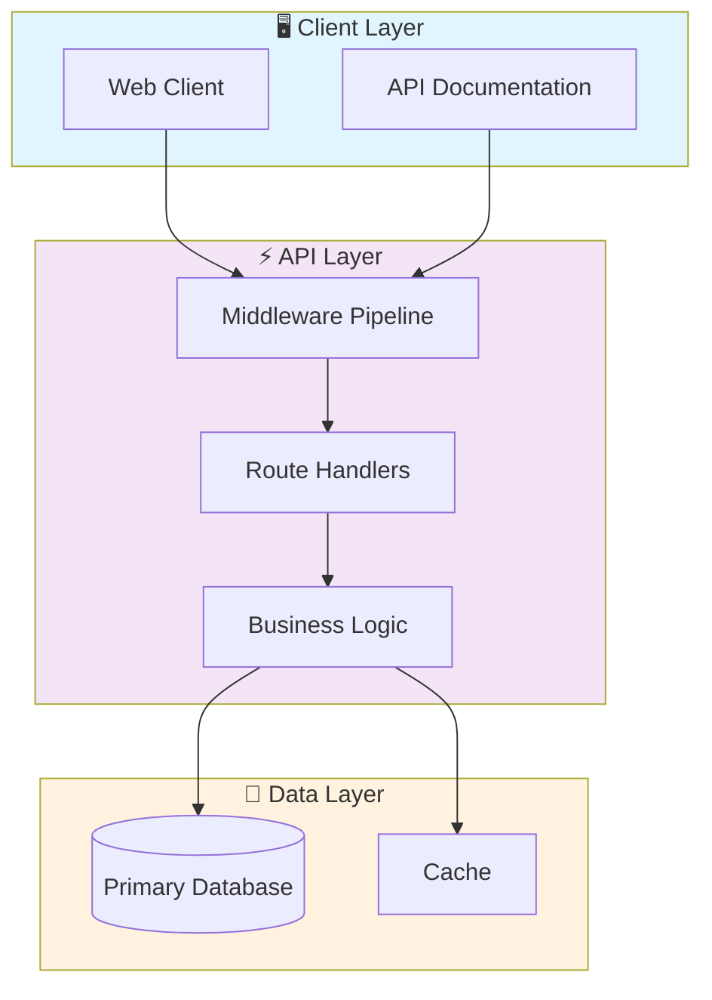

# 📊 Trae Dashboard Generator

> AI-powered dashboard generator using Trae IDE. Automatically creates interactive data visualizations and business dashboards from data sources with intelligent layout suggestions.

[](https://img.shields.io/badge/)
[](https://img.shields.io/badge/)
[](https://img.shields.io/badge/)
[](https://img.shields.io/badge/)
[](LICENSE)

[English](#english) | [Português](#português)

---

## English

### 🎯 Overview

**Trae Dashboard Generator** is a production-grade TypeScript application complemented by CSS, HTML, SQL that showcases modern software engineering practices including clean architecture, comprehensive testing, containerized deployment, and CI/CD readiness.

The codebase comprises **11,823 lines** of source code organized across **104 modules**, following industry best practices for maintainability, scalability, and code quality.

### ✨ Key Features

- **📊 Interactive Visualizations**: Dynamic charts with real-time data updates
- **🎨 Responsive Design**: Adaptive layout for desktop and mobile devices
- **📈 Data Aggregation**: Multi-dimensional data analysis and filtering
- **📥 Export Capabilities**: PDF, CSV, and image export for reports
- **🐳 Containerized**: Docker support for consistent deployment

### 🏗️ Architecture



### 🚀 Quick Start

#### Prerequisites

- Node.js 20+
- npm or yarn

#### Installation

```bash
# Clone the repository
git clone https://github.com/galafis/trae-dashboard-generator.git
cd trae-dashboard-generator

# Install dependencies
npm install
```

#### Running

```bash
# Development mode
npm run dev

# Production build
npm run build
npm start
```

### 🧪 Testing

```bash
# Run all tests
npm test

# Run with coverage
npm run test:coverage
```

### 📁 Project Structure

```
trae-dashboard-generator/
├── client/
│   ├── public/
│   └── src/          # Source code
│       ├── _core/
│       ├── components/
│       ├── contexts/
│       ├── hooks/
│       ├── lib/
│       ├── pages/
│       ├── App.tsx
│       ├── const.ts
│       └── main.tsx
├── drizzle/
│   ├── meta/
│   │   ├── 0000_snapshot.json
│   │   ├── 0001_snapshot.json
│   │   └── _journal.json
│   ├── migrations/
│   ├── 0000_damp_logan.sql
│   ├── 0001_aromatic_mordo.sql
│   ├── relations.ts
│   └── schema.ts
├── patches/
├── server/
│   ├── _core/
│   │   ├── types/
│   │   ├── context.ts
│   │   ├── cookies.ts
│   │   ├── dataApi.ts
│   │   ├── env.ts
│   │   ├── imageGeneration.ts
│   │   ├── index.ts
│   │   ├── llm.ts
│   │   ├── notification.ts
│   │   ├── oauth.ts
│   │   ├── sdk.ts
│   │   ├── systemRouter.ts
│   │   └── trpc.ts
│   ├── db.ts
│   ├── routers.ts
│   └── storage.ts
├── shared/
│   ├── _core/
│   │   └── errors.ts
│   ├── const.ts
│   └── types.ts
├── Dockerfile
├── LICENSE
├── README.md
├── components.json
├── drizzle.config.ts
├── package.json
├── pnpm-lock.yaml
├── tsconfig.json
├── vite.config.ts
└── vitest.config.ts
```

### 🛠️ Tech Stack

| Technology | Description | Role |
|------------|-------------|------|
| **TypeScript** | Core Language | Primary |
| **Docker** | Containerization platform | Framework |
| **React** | Frontend UI library | Framework |
| SQL | 2 files | Supporting |
| HTML | 1 files | Supporting |
| CSS | 1 files | Supporting |

### 🤝 Contributing

Contributions are welcome! Please feel free to submit a Pull Request. For major changes, please open an issue first to discuss what you would like to change.

1. Fork the project
2. Create your feature branch (`git checkout -b feature/AmazingFeature`)
3. Commit your changes (`git commit -m 'Add some AmazingFeature'`)
4. Push to the branch (`git push origin feature/AmazingFeature`)
5. Open a Pull Request

### 📄 License

This project is licensed under the MIT License - see the [LICENSE](LICENSE) file for details.

### 👤 Author

**Gabriel Demetrios Lafis**
- GitHub: [@galafis](https://github.com/galafis)
- LinkedIn: [Gabriel Demetrios Lafis](https://linkedin.com/in/gabriel-demetrios-lafis)

---

## Português

### 🎯 Visão Geral

**Trae Dashboard Generator** é uma aplicação TypeScript de nível profissional, complementada por CSS, HTML, SQL que demonstra práticas modernas de engenharia de software, incluindo arquitetura limpa, testes abrangentes, implantação containerizada e prontidão para CI/CD.

A base de código compreende **11,823 linhas** de código-fonte organizadas em **104 módulos**, seguindo as melhores práticas do setor para manutenibilidade, escalabilidade e qualidade de código.

### ✨ Funcionalidades Principais

- **📊 Interactive Visualizations**: Dynamic charts with real-time data updates
- **🎨 Responsive Design**: Adaptive layout for desktop and mobile devices
- **📈 Data Aggregation**: Multi-dimensional data analysis and filtering
- **📥 Export Capabilities**: PDF, CSV, and image export for reports
- **🐳 Containerized**: Docker support for consistent deployment

### 🏗️ Arquitetura


### 🚀 Início Rápido

#### Prerequisites

- Node.js 20+
- npm or yarn

#### Installation

```bash
# Clone the repository
git clone https://github.com/galafis/trae-dashboard-generator.git
cd trae-dashboard-generator

# Install dependencies
npm install
```

#### Running

```bash
# Development mode
npm run dev

# Production build
npm run build
npm start
```

### 🧪 Testing

```bash
# Run all tests
npm test

# Run with coverage
npm run test:coverage
```

### 📁 Estrutura do Projeto

```
trae-dashboard-generator/
├── client/
│   ├── public/
│   └── src/          # Source code
│       ├── _core/
│       ├── components/
│       ├── contexts/
│       ├── hooks/
│       ├── lib/
│       ├── pages/
│       ├── App.tsx
│       ├── const.ts
│       └── main.tsx
├── drizzle/
│   ├── meta/
│   │   ├── 0000_snapshot.json
│   │   ├── 0001_snapshot.json
│   │   └── _journal.json
│   ├── migrations/
│   ├── 0000_damp_logan.sql
│   ├── 0001_aromatic_mordo.sql
│   ├── relations.ts
│   └── schema.ts
├── patches/
├── server/
│   ├── _core/
│   │   ├── types/
│   │   ├── context.ts
│   │   ├── cookies.ts
│   │   ├── dataApi.ts
│   │   ├── env.ts
│   │   ├── imageGeneration.ts
│   │   ├── index.ts
│   │   ├── llm.ts
│   │   ├── notification.ts
│   │   ├── oauth.ts
│   │   ├── sdk.ts
│   │   ├── systemRouter.ts
│   │   └── trpc.ts
│   ├── db.ts
│   ├── routers.ts
│   └── storage.ts
├── shared/
│   ├── _core/
│   │   └── errors.ts
│   ├── const.ts
│   └── types.ts
├── Dockerfile
├── LICENSE
├── README.md
├── components.json
├── drizzle.config.ts
├── package.json
├── pnpm-lock.yaml
├── tsconfig.json
├── vite.config.ts
└── vitest.config.ts
```

### 🛠️ Stack Tecnológica

| Tecnologia | Descrição | Papel |
|------------|-----------|-------|
| **TypeScript** | Core Language | Primary |
| **Docker** | Containerization platform | Framework |
| **React** | Frontend UI library | Framework |
| SQL | 2 files | Supporting |
| HTML | 1 files | Supporting |
| CSS | 1 files | Supporting |

### 🤝 Contribuindo

Contribuições são bem-vindas! Sinta-se à vontade para enviar um Pull Request.

### 📄 Licença

Este projeto está licenciado sob a Licença MIT - veja o arquivo [LICENSE](LICENSE) para detalhes.

### 👤 Autor

**Gabriel Demetrios Lafis**
- GitHub: [@galafis](https://github.com/galafis)
- LinkedIn: [Gabriel Demetrios Lafis](https://linkedin.com/in/gabriel-demetrios-lafis)
